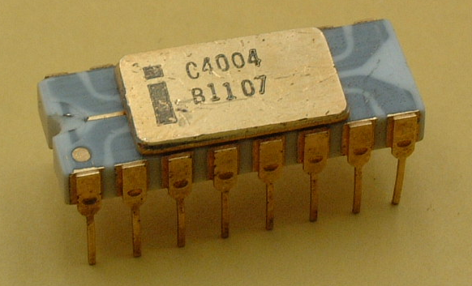
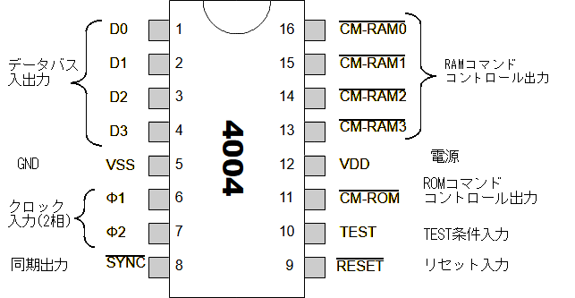
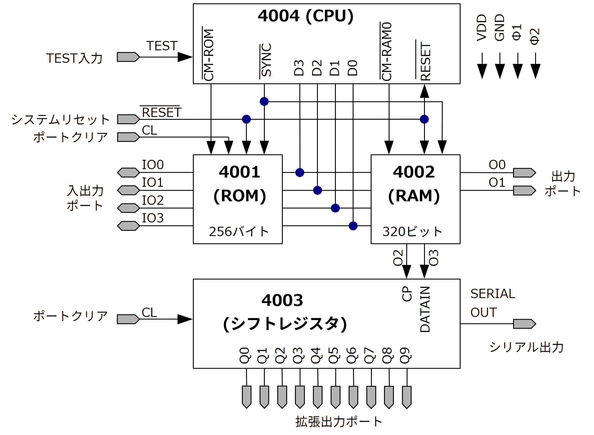
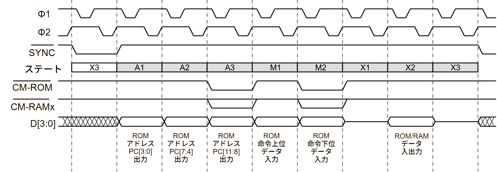
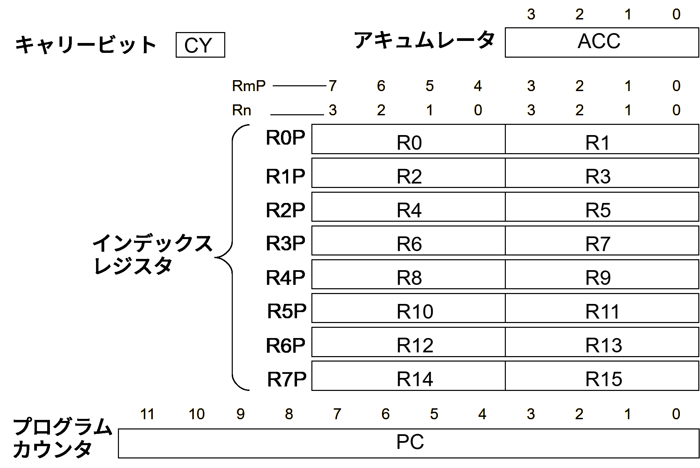
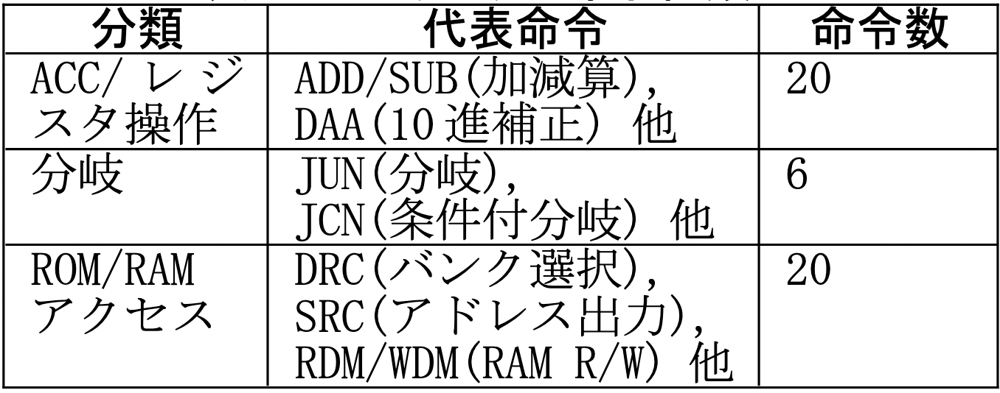
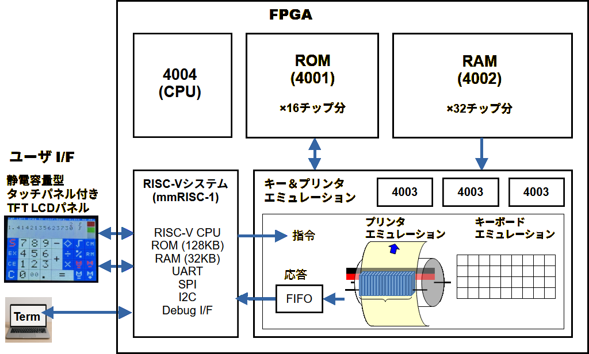
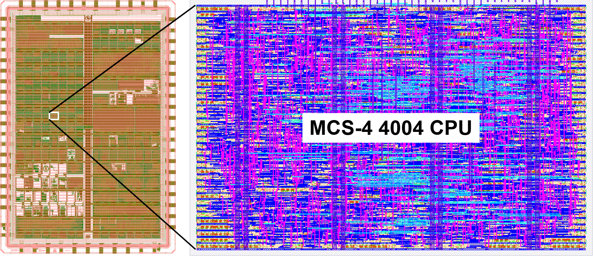
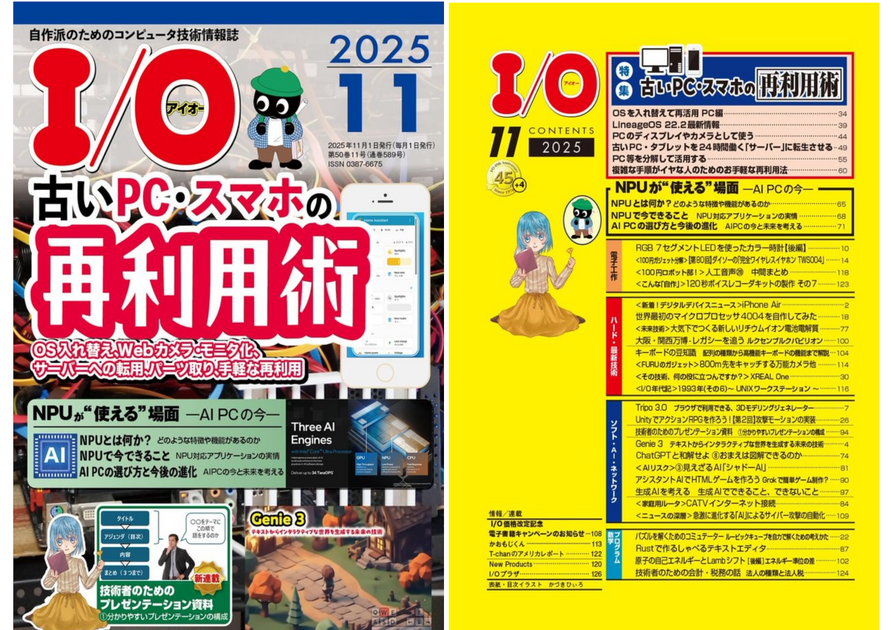

# 世界最初のマイクロプロセッサ4004を自作してみた

世界最初のマイクロプロセッサ4004を自作してみました。２種類あって、一つはFPGAの上、もう一つはTiny Tapeoutというサービスを使ったシリコンの上です。

## インテル4004って何？
4004は1971年に登場した4ビットCPUで、10μm PMOSプロセスで製造されました。動作周波数750KHz、チップサイズ3mm×4mm、トランジスタ数2237個、電源電圧はマイナス15Vでした。当時の半導体は現代の最先端プロセスと比べるとトランジスタ密度は100万分の1程度と低く、チップ上に多くの回路を実装できません。しかし、4004は当時の技術レベルでも、最大限の効果を出す工夫を凝らしていました。 

 
4004 CPUチップの外観 (http://www.intel-vintage.info/intelmcs.htm) 

この写真のパッケージは、4004の初期バージョンで、リードフレームが透けて見えていて、フィッシュボーンよかグレースケールとか呼ばれる貴重なものです。eBayとかでの取引価格は20万円〜30万円！となかなかのお値段となっております。これは経済的に手を出せないので、私はもっと安価なプラスティックDIP版しか持っていません。 

## 4004の開発経緯と日本人の活躍
かつて日本にビジコン社という電卓メーカがあり、電卓用のカスタムチップをインテル社に開発委託しました。インテル社は専用カスタムチップの種類を減らすため、汎用性を持たせたコンピュータ方式を提案し、ビジコン社の嶋正利氏が論理設計を担当して4004(CPU)を開発しました。同時に4004(CPU)と組み合わせる周辺チップセット、すなわち4001(ROM)、4002(RAM)、4003(ポート拡張用シフトレジスタ)も開発しました。試作チップは一発で完動し、それらを使ったビジコン社の電卓141-PFもすぐに動作したそうです。嶋氏をはじめとする技術者達の意気込みと熱意を感じます。しかしその後、インテル社が4004の汎用プロセッサとしての可能性に気付いたことと、ビジコン社の資金繰りの問題から、インテル社が4004の権利を買い取り、4001〜4004のチップセットを汎用のコンピュータシステムMCS-4（Micro Computer Set-4）として販売することになりました。その後インテル社はプロセッサメーカとして大きく成長していくことになります。

 
Busicom社電卓141-PF (http://www.dentaku-museum.com/calc/calc/10-busicom/busicomd/busicomd.html) 

## 4004 CPUのシステムアーキテクチャ

4004は演算処理するデータ幅が4ビットであり、現代の32ビットや64ビットプロセッサに比べれば見劣りしますが、4ビットで表現できる数字（0～9）を１桁ずつ10進数で計算していく電卓には適していました。ちなみに、4004以降は、コンピュータとして文字（ASCIIコード）を処理することが増えたので8ビットCPU（8080やZ80）の登場につながっていきます。 

以下に4004の端子配列を示します。パッケージは16ピンDIPです。 
 
4004 CPU端子配列 

4004は周辺チップの4001(ROM)、4002(RAM)、4003(シフトレジスタ)と組み合わせてコンピュータシステムを構成しました。4001(ROM)と4002(RAM)はメモリ機能だけでなくパラレルポート機能も備えています。いずれのチップも16ピンDIPに統一されています。このシステムをMCS-4といい、その最小構成例を以下に示します。 

 
MCS-4システムの最小構成 

## CPU機能の一部を担うROMとRAM

この構成を最初に見たとき、どうしてこれがコンピュータとして動くのか不思議でした。まず、CPUとROM/RAMは4ビット幅のデータバス（D0～D3）で接続されていますが、アドレスバスがありません。また、ROMやRAMの選択信号らしいもの（/CM_ROM、/CM_RAM0～/CM_RAM3）はありますが、RAMに対してリードするかライトするかを選択する信号がありません。どうやってROMとRAMをアクセスするのでしょうか？

 
4004(CPU)の命令ステート動作 

CPUは基本的に1命令を8ステート（8クロック）で処理します。ROMとRAMは信号によりCPUステートと同期して動作します。まず、ROMのアドレス12ビット分を、ステートA1～A3でCPUがデータバスから4ビットずつ3回に分けて出力します。次に、ステートM1～M3でCPUはROMから8ビット分の命令コード（4ビット×2回）をリードします。このCPUが命令コードを取り込むときに、なんとROMとRAMも命令コードをデータバスから取り込んで次に自分がどのステートで何をすべきか（リードかライトか、アクセス先はメモリかポートか）を決めておくのです。そしてステートX2でROMとRAMは読み取った命令に従った動作をします。このように、ROMとRAMがCPUの一部の機能を担っているという大変おもしろい仕組みであり、信号数を減らして16ピンパッケージに各チップを収めるための先人の知恵と工夫が詰まったアーキテクチャだといえます。

#4004の命令セットアーキテクチャ

下図は4004のプログラマーズモデルです。4004はメモリアクセスするときに複数命令を組み合わせる必要があるので、性能を出すためにできるだけメモリアクセスを減らすほうがよく、その結果コードサイズも減らせます。そのため、4004にはインデックスレジスタ（R0～R15）が16本もあり、一時的にデータを格納してメモリアクセスを減らします。この仕組みは、現代のRISC（Reduced Instruction Set Computer）アーキテクチャの思想と同じであり、先人の知恵の先進性を感じます。R0～R15は4ビット幅ですが、2個ずつペアで連接して8ビット幅のR0P～R7Pとして使うこともできます。 

 
4004(CPU)のプログラマーズモデル 

4004の命令体系を下表に示します。命令は46種類もありコンピュータとして完成された体系となっていて、その後の8ビットCPU（8080、Z80など）に引き継がれた命令も多くあります。ひとつ、特徴的な命令を紹介しましょう。それは条件分岐命令JCNで、外部のTEST端子の入力レベルを分岐条件に含めることができるものです。JCN命令により外部ハードウェアとの同期が可能になり、現在のCPUが持つ割込みと同様な効果を実現できるようになっています。

 
4004(CPU)の命令種類 

## MCS-4システム（4001・4002・4003・4004）と電卓141-PFを再現した〜い！
私が最初にマイコンに触れたのは高校生の時で、NECのTK-80で、そこからマイコンの魅力に取り憑かれました。その後、マイコン少年、マイコン青年、マイコン壮年、マイコン老人と人生を辿っていくことになりました。TK-80はCPUとして8080Aを使っており、当時すでに8ビットでした。4ビットの4004というのが最初のマイクロコンピュータとして存在していることは知っていましたが、具体的な中身を知るようになったのは、ようやく今から10年くらい前です。調べていくと、とても魅力的なアーキテクチャであり、これは是非とも自作してみたい、そして、ビジコン社の電卓141-PFを再現したいと思うようになりました。 

## 詳しい設計データと設計ドキュメント
MCS-4システムと電卓141-PFの再現設計に関する詳細は下記GitHubのレポジトリを参照してください。すべてのコードと詳細な100ページ以上のドキュメントも置いてあります。

- [MCS4_SYSTEM](https://github.com/munetomo-maruyama/MCS4_SYSTEM/tree/main)  

## 4004ソフトウェア開発環境
4004のソフトウェア開発環境はアセンブラです。今は入手できないので、アセンブラ、逆アセンブラ、命令シミュレータの機能を持つアプリADS4004を自作しました。アプリ本体のCソースも上記GitHubから入手できます。以下に4004命令のアセンブル例を示します。

    000                 org 0x000
    000 D1     MEMTST  ldm 1
    001 FD              dcl
    002 22 34          fim 1P 0x34
    004 23              src 1P
    005 DA              ldm 0xa
    006 E0              wrm

## まずはFPGAへ実装

　4004とそのチップセット4001～4003をハードウェア記述言語Verilog HDLで記述しました。メモリは最大構成とし、ROMを16チップ分（4096バイト）、RAMを32チップ分（1280バイト）搭載しています。これをFPGAに実装しました。FPGAボードはTerasic社のDE10-Liteで、アルテラ社のMAX 10（10M50）を搭載しています。FPGA内の回路ブロック図とFPGAボードの外形を以下に示します。 

 
FPGA内の回路ブロック図 

 
FPGAボードの外観 

このシステムでビジコン社の電卓141-PFも再現しました。実物のユーザインタフェースと同じ機能を自作のRISC-Vシステムと静電容量式タッチパネル付きカラーLCDパネルで再現しました。ネット上に電卓の4004プログラムが公開されており、それがそのまま動作します。再現した電卓141-PFは平方根計算、メモリ計算、パーセント計算もあり、現代の電卓と同等の機能を持っています。CPUの動作周波数は実チップと同じ750KHzで動作させましたが実用的に問題ありません。プログラムサイズは全部で1280バイトしかなく、そのうち平方根計算はたったの256バイトです。4004のコード効率の高さにも驚かされます。 

- [mRISC](https://github.com/munetomo-maruyama/mmRISC-1）

## 挑戦！4004 CPUで円周率500桁を計算してみた
4004 CPUの実力の限界に挑みたくて、4004 CPUアセンブリ言語で、マチンの公式を使用して数学定数π（パイ）を500桁計算するプログラムを開発し、実行しました。4004は、その原始的な命令セットにもかかわらず、驚くほど十分な計算能力を発揮してくれます。クロック速度750 KHzでの計算時間は約17分でした。最終結果である円周率500桁は、141-PFプリンター（エミュレーション）が印字してくれました。このプログラムソースも上記レポジトリに格納してありますので読んでみてください。

    1415926535      
    8979323846      
    2643383279      
    5028841971      
    6939937510      
    5820974944      
    5923078164      
    0628620899      
    ..........
    0921861173      
    8193261179      
    3105118548      
    0744623799      
    6274956735      
    1885752724      
    8912279381      
    8301194912

## Tiny Tapeoutで4004半導体チップを製造
次に、4004を実際の半導体チップとして蘇らせる試みを紹介します。

### Tiny Tapeoutとは
Tiny Tapeoutは、ひとつのチップに複数のプロジェクトが乗り合いする半導体製造サービスです。これを使うと、個人でも手が届く金額で半導体チップを設計して製造することができます。2025年9月に、米国Skywater社の130nmプロセスのウェハ試作（シャトル）に設計データを提出できる機会があり、試してみました。プロジェクトの最小単位の１区画には2000ゲート程度の規模の回路を実装できます。規模が大きい回路の場合は、複数区画を使うこともできます。ただし、ひとつのプロジェクトが使える端子は、入力×8本、出力×8本、入出力8本の合計24本のみです。これはまさにDIP16ピンの4004に丁度よい規模感でした。

- [Tiny Tapeout]（https://tinytapeout.com/）

### Tiny Tapeoutの設計フロー
一般の半導体チップの設計には、高価な設計ツールと秘密保持契約が必要なプロセス設計キット（PDK: Process Design Kit）が必要ですが、Tiny Tapeoutではオープンソースの設計ツールと契約不要なオープンなPDKを使って自宅のPCで設計できます。これらのツールはリモートのクラウドサーバー上で動作するので、必ずしもローカルなPC環境にツール群をインストールする必要はありません。しかし、設計リトライを繰り返す場合は、ローカル環境にツールをインストールしたほうが効率は良いです。そのインストール方法はTiny Tapeoutのサイトに掲載されています。 
4004をTiny Tapeoutでチップ設計した結果 

Tiny TapeoutベースでVerilog HDLで設計する場合、本家サイトのテンプレートレポジトリをForkして設計作業します。その設計作業をした場所が以下のレポジトリです。ただし、新たに同じテンプレートを使うプロジェクトを立ち上げる場合、GitHubのポリシーとして同じレポジトリを複数Forkすることはできないので、Forkをデタッチする必要があります。以下のURLはすでに本家テンプレートからForkをデタッチした状態になっています。

- [ttsky25a_MCS4](https://github.com/munetomo-maruyama/ttsky25a_MCS4_CPU)  

## 工学社 I/O誌 2025年11月号に記事を掲載
ISHI会さんのご支援で、工学社 I/O誌 2025年11月号に本プロジェクトの記事を掲載いただきました。

 
工学社 I/O誌 2025年11月号 

## EdgeTech+2025のチップミュージアムmini#にて展示いただきました！
2025年11月19日〜11月21日に開催されたEdgeTech+2025の特別企画展「チップミュージアムmini#」は、貴重な歴史あるさまざまなICやLSIの実物を収集されている秀関快郎氏のお宝コレクションが多数展示されていました。その価値ある場に、何と、このプロジェクトで再現した電卓141-PFのFPGAシステムを展示いただきました。

 
EdgeTech+2025のチップミュージアムmini# 

## 4004イベントを2026年3月に開催予定！！

4004を味わい尽くすイベントを2026年3月に開催します。参加は無料です。奮ってご参加ください。 
ご希望の方には、4004と同一形状のDIP16ピンのFPGAとその書き込み機も有償提供します。ブレッドボードで簡単に実験できるお手軽FPGAです。4004 CPUの論理も入っちゃいます。こちらは数が限られているので、お早めに！

 

- []Days on the ZEP 4004 Special (https://www.zep.co.jp/before_after_pcb/web_seminar/zep4004/index.html)

## このプロジェクトの感想
4004というアーキテクチャを再現するために色々と調べましたが、とても魅力的で、最小限のリソースで最大限の効果を出す好例だと思います。電卓141-PFのプログラムソースがそのまま何の修正もせずに動作したのは感動でした。MCS-4システムのメモリを最大構成にすれば、円周率を500桁計算することもできちゃいました。完璧なコンピュータです。そして何といっても、Tiny Tapeoutというサービスでシリコンにも仕上げることができてしまうという時代になりました。オープンソースシリコンとISHI会、ここにあり！という感じです。大いに楽しませてもらっています。Tiny Tapeoutの実シリコンは2026年3月にファブアウトして、入手できるのは2026年6月か7月ごろのようです。今から楽しみです。

## 参考文献
(1) 嶋 正利；マイクロコンピュータの誕生＜わが青春の4004＞,1987年8月,岩波書店
(2) 圓山宗智,MAX10実験キットで学ぶFPGA＆コンピュータ,23～24章,2016年,CQ出版社

## Firmware References
This project utilizes historical firmware related to the 141-PF calculator:
- [4001.code - Simulator with Flowchart](http://www.4004.com/assets/busicom-141pf-simulator-w-flowchart-071113.zip)  
- [Assembly Source – Busicom 141-PF Calculator](http://www.4004.com/2009/Busicom-141PF-Calculator_asm_rel-1-0-1.txt)

These resources are distributed under the following license, which this project inherits:
- [Creative Commons Attribution-NonCommercial-ShareAlike 2.5](https://creativecommons.org/licenses/by-nc-sa/2.5/legalcode)
 

